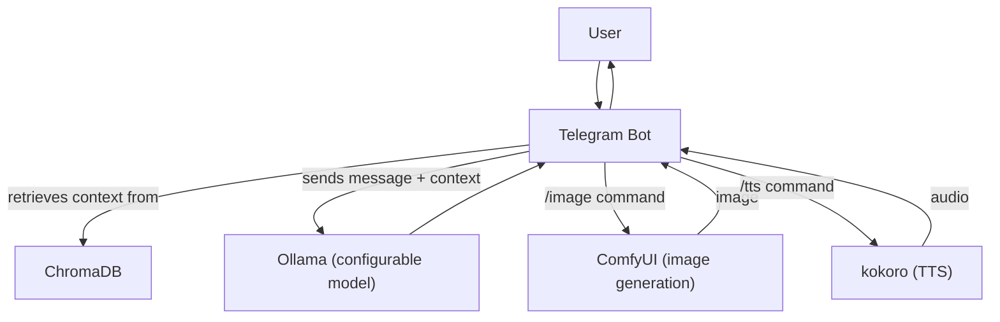

# TGBot

A Telegram bot that forwards messages to a local Ollama server (using a model of your choice) and replies with context-aware responses. Now also supports image generation via ComfyUI, and audio via kokoro.

## Quick Start

### Example .env file

Create a `.env` file in your project root with the following content:

```env
BOT_TOKEN=123456789:ABCdefGHIjklMNOpqrSTUvwxYZ0123456789
OLLAMA_MODEL=llama2
COMFY_PATH=C:/Users/you/Desktop/ComfyUI
PROMPT_FILE=C:/Users/you/Desktop/TGBot/assets/flux_template.json
# Optional: SYSTEM_PROMPT=You are a helpful assistant.
```

- `BOT_TOKEN`: Your Telegram bot token from BotFather
- `OLLAMA_MODEL`: The model name for Ollama (e.g. llama2, phi, etc.)
- `COMFY_PATH`: Path to your ComfyUI installation (directory containing main.py)
- `PROMPT_FILE`: Path to the prompt JSON file for ComfyUI
- `SYSTEM_PROMPT`: (Optional) Custom system prompt for the LLM

### Prerequisites
- **Ollama** installed and available in your system PATH ([see instructions](https://ollama.com/download))
- **ComfyUI** installed and accessible (see [ComfyUI](https://github.com/comfyanonymous/ComfyUI))
- **Windows users**: Visual Studio required for Chroma. On Windows, Ollama requires WSL2.

### Installation
```bash
python -m venv venv
source venv/bin/activate  # or source venv/Scripts/activate on Windows
pip install -r requirements.txt
# Add BOT_TOKEN=..., OLLAMA_MODEL=..., COMFY_PATH=..., PROMPT_FILE=... to a .env file
python main.py [--show-context]
```

- Ollama will be started automatically by the bot if not already running.
- The bot uses the model specified by the `OLLAMA_MODEL` variable in your `.env` file.
- The bot keeps a short-term memory (last 30 messages per user) for context.
- All messages are stored in ChromaDB with embeddings for persistent, semantic search.
- Use `--show-context` to print the context window sent to the LLM for each user message.
- **Image generation**: Use the `/image <prompt>` command in Telegram to generate an image with ComfyUI.
- **Help**: Use the `/help` command in Telegram to see all available commands and their descriptions.

## Commands

- `/start` — Start the bot and get a welcome message.
- `/help` — Show a list of all available commands and their descriptions.
- `/image <prompt>` — Generate an image from a prompt using ComfyUI.
- `/tts` — Convert the last message (user or bot) to speech and send as a voice message.
- *(You can also just send a message to chat with the bot!)*


## Image Generation with ComfyUI

- Use the `/image <prompt>` command in Telegram to generate an image.
- The prompt is injected into a template JSON (see `assets/flux_template.json`).
- Images are saved in the ComfyUI output directory (as defined by `COMFY_PATH/output`).

## Architecture



## Features
- Retrieval-augmented generation (RAG) ready: Use retrieved messages to enhance LLM prompts.
- **Image generation**: Generate images from text prompts using ComfyUI and receive them in Telegram.
- **Text-to-speech**: Use `/tts` to convert the last message to a voice message.
- **Help command**: Use `/help` to see all available commands and their usage.

## Troubleshooting
- If you see errors, ensure Ollama is installed and your .env has the correct BOT_TOKEN and OLLAMA_MODEL.
- The first request to a new model may take longer as Ollama downloads it.
- For image generation:
  - Ensure `COMFY_PATH` and `PROMPT_FILE` are set correctly in your .env file.
  - Make sure ComfyUI dependencies are installed and working.
  - If the image is not generated, check the ComfyUI logs and output directory.

## [License](./LICENSE)
