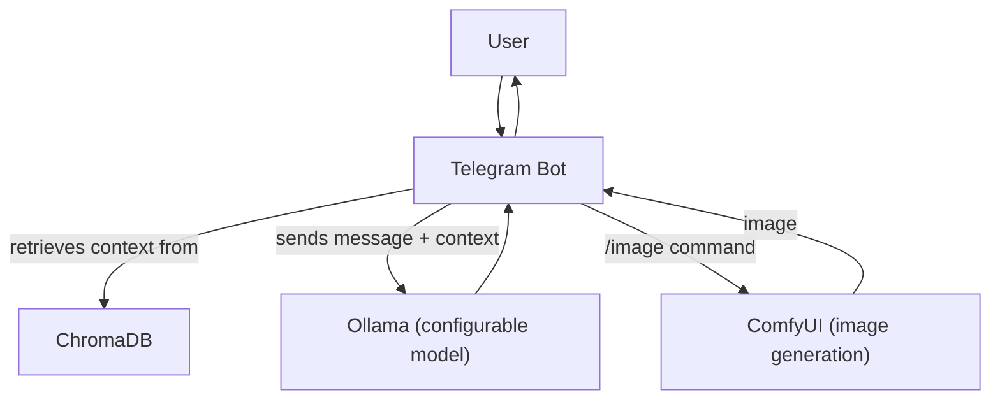

# TGBot

A Telegram bot that forwards messages to a local Ollama server (using a model of your choice) and replies with context-aware responses. Now also supports image generation via ComfyUI.

## Quick Start

### Prerequisites
- **Ollama** installed and available in your system PATH ([see instructions](https://ollama.com/download))
- **ComfyUI** installed and accessible (see [ComfyUI](https://github.com/comfyanonymous/ComfyUI))
- **Windows users**: Visual Studio required for Chroma. On Windows, Ollama requires WSL2.

### Installation
```bash
python -m venv venv
source venv/bin/activate  # or source venv/Scripts/activate on Windows
pip install -r requirements.txt
# Add BOT_TOKEN=..., OLLAMA_MODEL=..., COMFY_PATH=..., PROMPT_FILE=... to a .env file
python main.py [--show-context]
```

- Ollama will be started automatically by the bot if not already running.
- The bot uses the model specified by the `OLLAMA_MODEL` variable in your `.env` file.
- The bot keeps a short-term memory (last 30 messages per user) for context.
- All messages are stored in ChromaDB with embeddings for persistent, semantic search.
- Use `--show-context` to print the context window sent to the LLM for each user message.
- **Image generation**: Use the `/image <prompt>` command in Telegram to generate an image with ComfyUI.

## Environment Variables
- `BOT_TOKEN`: Your Telegram bot token
- `OLLAMA_MODEL`: The Ollama model to use (e.g. "llama2")
- `COMFY_PATH`: Path to your ComfyUI installation (directory containing main.py)
- `PROMPT_FILE`: Path to the prompt JSON file to be used by ComfyUI (e.g. `C:/Users/you/Desktop/TGBot/assets/flux_template.json`)

## Image Generation with ComfyUI

- Use the `/image <prompt>` command in Telegram to generate an image.
- The bot will:
  1. Stop the Ollama server (if running)
  2. Launch ComfyUI and send the prompt
  3. Wait for the image to be generated
  4. Send the image back to you in Telegram
  5. Shut down ComfyUI
  6. Restart the Ollama server
- The prompt is injected into a template JSON (see `assets/flux_template.json`).
- Images are saved in the ComfyUI output directory (as defined by `COMFY_PATH/output`).

## Architecture



## Features
- Persistent vector memory: All messages are stored in ChromaDB for long-term memory.
- Semantic search: The bot can retrieve and use similar past messages based on meaning, not just keywords.
- Retrieval-augmented generation (RAG) ready: Use retrieved messages to enhance LLM prompts.
- **Image generation**: Generate images from text prompts using ComfyUI and receive them in Telegram.

## Troubleshooting
- If you see errors, ensure Ollama is installed and your .env has the correct BOT_TOKEN and OLLAMA_MODEL.
- The first request to a new model may take longer as Ollama downloads it.
- On Windows, ensure WSL2 is set up and Ollama is installed inside your WSL2 environment.
- For image generation:
  - Ensure `COMFY_PATH` and `PROMPT_FILE` are set correctly in your .env file.
  - Make sure ComfyUI dependencies are installed and working.
  - If the image is not generated, check the ComfyUI logs and output directory.

## [License](./LICENSE)
