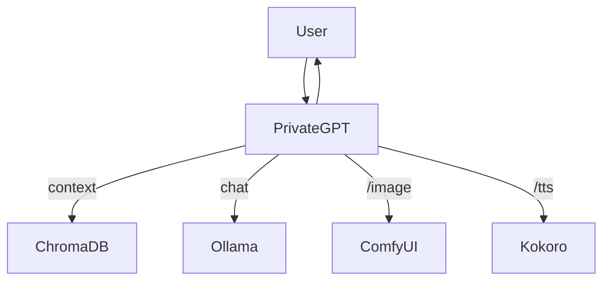

# PrivateGPT

A Telegram bot that connects your chats to local LLMs (like LLaMA), generates images, and speaks with TTS—all running on your own machine.

---

## Features

- **Conversational AI:** Local LLM (Ollama) for chat.
- **Image Generation:** `/image <prompt>` via ComfyUI.
- **Text-to-Speech:** `/tts` to convert messages to audio.
- **Persistent Memory:** ChromaDB for semantic search.
- **Easy Setup:** `.env` config, Docker-ready.

---

## Quick Start

1. **Clone & Install**
    ```bash
    git clone https://github.com/adnjoo/PrivateGPT.git
    cd PrivateGPT
    python -m venv venv
    source venv/bin/activate  # or venv\Scripts\activate on Windows
    pip install -r requirements.txt
    ```

2. **Configure**
    - Create a `.env` file:
      ```
      BOT_TOKEN=...
      OLLAMA_MODEL=...
      COMFY_PATH=...
      PROMPT_FILE=...
      # Optional: SYSTEM_PROMPT=...
      ```

3. **Run**
    ```bash
    python main.py
    ```

---

## Commands

- `/start` — Welcome message
- `/help` — List commands
- `/image <prompt>` — Generate an image
- `/tts` — Last message to voice

---

## Architecture



---

## Requirements

- Python 3.10+
- [Ollama](https://ollama.com/)
- [ComfyUI](https://github.com/comfyanonymous/ComfyUI)
- (Windows) Visual Studio for ChromaDB

---

## License

MIT
