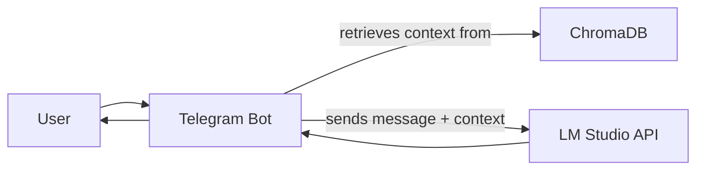

# TGBot

A Telegram bot that forwards messages to a local LM Studio server and replies with context-aware responses. Now with persistent vector memory and semantic search using ChromaDB and Sentence Transformers.

## Quick Start
```bash
python -m venv venv
source venv/bin/activate  # or venv/Scripts/activate on Windows
pip install -r requirements.txt
# Add BOT_TOKEN=... to a .env file
python main.py [--show-context]
```

- Requires LM Studio running at http://localhost:1234/v1/chat/completions
- The bot keeps a short-term memory (last 30 messages per user) for context.
- All messages are stored in ChromaDB with embeddings for persistent, semantic search.
- Use `--show-context` to print the context window sent to the LLM for each user message.

## Architecture



## Features
- Persistent vector memory: All messages are stored in ChromaDB for long-term memory.
- Semantic search: The bot can retrieve and use similar past messages based on meaning, not just keywords.
- Retrieval-augmented generation (RAG) ready: Use retrieved messages to enhance LLM prompts.

## Troubleshooting
- If you see errors, ensure LM Studio is running and your .env has the correct BOT_TOKEN.

## [License](./LICENSE)
