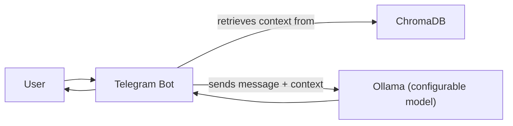

# TGBot

A Telegram bot that forwards messages to a local Ollama server (using a model of your choice) and replies with context-aware responses.

## Quick Start

### Prerequisites
- **Ollama** installed and available in your system PATH ([see instructions](https://ollama.com/download))
- **Windows users**: Visual Studio required for Chroma. On Windows, Ollama requires WSL2.

### Installation
```bash
python -m venv venv
source venv/bin/activate  # or source venv/Scripts/activate on Windows
pip install -r requirements.txt
# Add BOT_TOKEN=... and OLLAMA_MODEL=... to a .env file
python main.py [--show-context]
```

- Ollama will be started automatically by the bot if not already running.
- The bot uses the model specified by the `OLLAMA_MODEL` variable in your `.env` file.
- The bot keeps a short-term memory (last 30 messages per user) for context.
- All messages are stored in ChromaDB with embeddings for persistent, semantic search.
- Use `--show-context` to print the context window sent to the LLM for each user message.

## Architecture



## Features
- Persistent vector memory: All messages are stored in ChromaDB for long-term memory.
- Semantic search: The bot can retrieve and use similar past messages based on meaning, not just keywords.
- Retrieval-augmented generation (RAG) ready: Use retrieved messages to enhance LLM prompts.

## Troubleshooting
- If you see errors, ensure Ollama is installed and your .env has the correct BOT_TOKEN and OLLAMA_MODEL.
- The first request to a new model may take longer as Ollama downloads it.
- On Windows, ensure WSL2 is set up and Ollama is installed inside your WSL2 environment.

## [License](./LICENSE)
